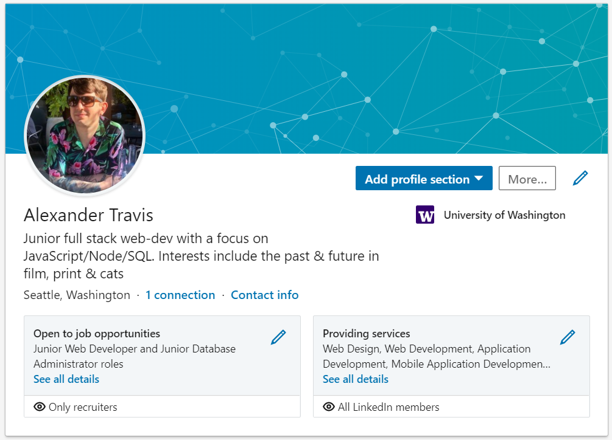
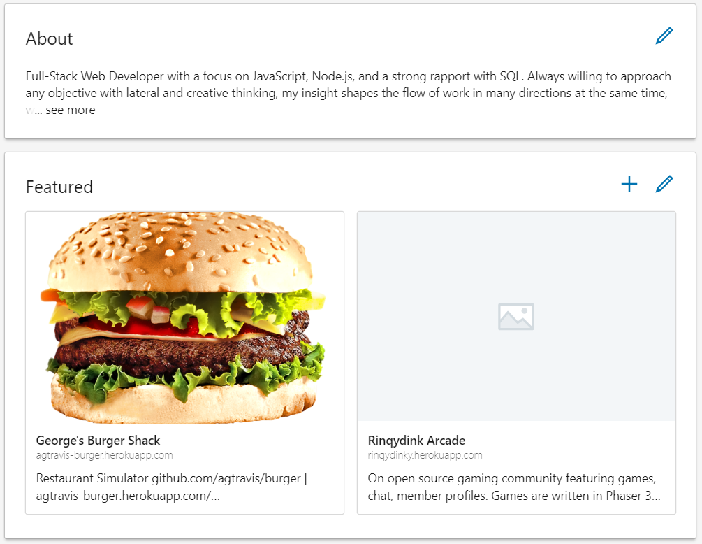
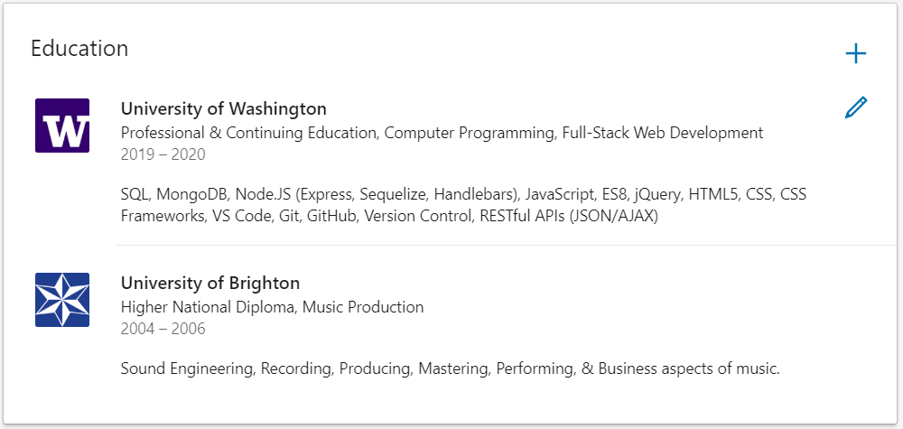
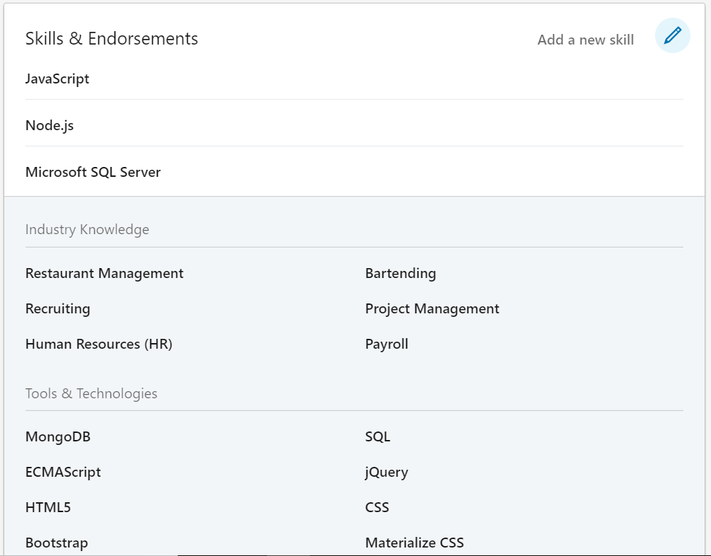
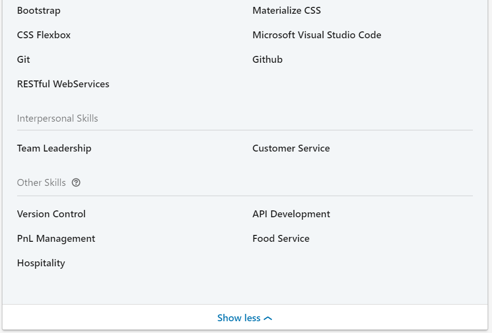

# My portfolio

[Portfolio](https://agtravis.github.io/)

## New features:

1. Links to my version-controlled resume, LinkedIn profile, and GitHub profile.
1. Switched out Bootstrap for Materialize (only used for a few responsive features on the main container, mostly responsive with media queries).
1. Entire portfolio generated dynamically from JavaScript with an array of objects representing my portfolio.

At present my LinkedIn is set to private, so below are some screenshots (there is no employment history on purpose for now so it will reduce search capabilities):

